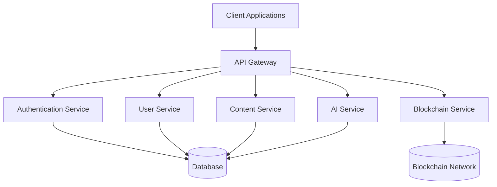

# Aetherial Platform Architecture

## System Overview

The Aetherial Platform is a cross-platform application that provides a unified experience across web, mobile, and desktop. The system is built with a microservices architecture, ensuring scalability, maintainability, and flexibility.

## High-Level Architecture

## Core Components

### 1. Client Applications

#### Web Application
- Built with React and Next.js
- Server-side rendering for better SEO and performance
- Progressive Web App (PWA) support
- Responsive design for all screen sizes

#### Mobile Applications
- Built with React Native
- Cross-platform (iOS and Android)
- Offline-first approach
- Native performance with JavaScript

#### Desktop Applications
- Built with Electron
- Cross-platform (Windows, macOS, Linux)
- Native system integration
- Auto-update functionality

### 2. Backend Services

#### API Gateway
- Single entry point for all client requests
- Request routing and composition
- Authentication and authorization
- Rate limiting and caching

#### Authentication Service
- User registration and login
- OAuth 2.0 and OpenID Connect
- JWT token management
- Session management

#### User Service
- User profile management
- Social graph (followers/following)
- Privacy settings
- Notifications

#### Content Service
- Post creation and management
- Media processing
- Content moderation
- Search and discovery

#### AI Service
- Natural language processing
- Computer vision
- Recommendation engine
- Chatbot and virtual assistants

#### Blockchain Service
- Digital asset management
- Smart contracts
- Transaction processing
- Wallet integration

### 3. Data Layer

#### Primary Database
- PostgreSQL for relational data
- JSONB for flexible schema
- Full-text search capabilities

#### Cache
- Redis for caching
- Session storage
- Pub/Sub messaging

#### Object Storage
- S3-compatible storage for media files
- CDN integration
- Image and video processing

### 4. Infrastructure

#### Container Orchestration
- Kubernetes for container orchestration
- Auto-scaling
- Self-healing

#### Monitoring and Logging
- Prometheus for metrics
- Grafana for visualization
- ELK Stack for logging

#### CI/CD
- GitHub Actions for CI/CD
- Automated testing
- Blue/Green deployments

## Data Flow

1. **User Authentication**
   - Client sends credentials to Authentication Service
   - JWT token is issued upon successful authentication
   - Token is stored securely and sent with subsequent requests

2. **Content Creation**
   - User creates content in the client application
   - Content is validated and sent to the API Gateway
   - API Gateway routes the request to the Content Service
   - Content is processed, stored, and indexed

3. **Content Consumption**
   - Client requests content from the API Gateway
   - API Gateway checks authentication and permissions
   - Content Service retrieves and returns the content
   - Client renders the content to the user

## Security Considerations

- All communication is encrypted with TLS 1.3
- Rate limiting to prevent abuse
- Input validation and sanitization
- Regular security audits
- Dependency vulnerability scanning

## Performance Considerations

- Caching at multiple levels (CDN, API, database)
- Lazy loading of non-critical resources
- Database query optimization
- Horizontal scaling of stateless services

## Deployment Architecture

### Development
- Local development with Docker Compose
- Hot-reloading for fast iteration
- Mock services for external dependencies

### Staging
- Mirrors production environment
- Automated testing
- Performance testing

### Production
- Multi-region deployment
- Auto-scaling
- Disaster recovery
- Zero-downtime deployments

## Technology Stack

### Frontend
- React 18
- Next.js 13
- TypeScript
- Tailwind CSS
- Redux Toolkit
- React Query

### Mobile
- React Native
- React Navigation
- Reanimated
- MMKV Storage

### Backend
- Node.js 18+
- NestJS
- TypeScript
- PostgreSQL
- Redis
- BullMQ

### Infrastructure
- Docker
- Kubernetes
- AWS/GCP/Azure
- Terraform
- GitHub Actions

## Future Considerations

- Edge computing for lower latency
- WebAssembly for performance-critical components
- Decentralized identity with blockchain
- AI/ML model serving at the edge
